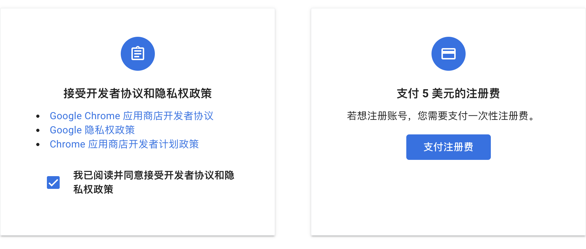

# 📚 书签管理系统

> **完全重构版本** - 数据库改为 D1，原项目在 [back 分支](https://github.com/deerwan/nav/tree/back)

基于 Cloudflare Pages + D1 + Vue 3 构建的现代化书签管理系统。

## ✨ 功能特性

### 📚 核心功能

- 📑 **分类管理**：创建、编辑、删除书签分类，支持多级嵌套分类
- 🔖 **书签管理**：添加、编辑、删除书签，支持拖拽排序
- 🔒 **私密书签**：支持设置私密书签，仅登录后可见
- 🔍 **实时搜索**：按名称、URL 或描述快速搜索书签，支持分类筛选和防抖优化
- 📥 **导入导出**：支持导出为 JSON/HTML 格式，导入浏览器书签（支持进度显示）
- ⚡ **批量操作**：批量移动、批量编辑属性（私密/公开）、批量删除书签和分类
- 🧹 **清理空分类**：自动检测并清理空分类
- 📊 **数据统计**：显示书签总数和私密书签统计

### 🎨 外观定制

- 🎨 **主题切换**：支持亮色/暗色/跟随系统三种主题模式
- 🖼️ **随机壁纸**：支持自定义壁纸 API，可设置页面背景壁纸
- 📝 **自定义标题**：自定义页面顶部标题文字
- 📄 **自定义页脚**：自定义页面底部内容（支持 HTML）
- 📋 **显示模式**：标准模式和高效模式（紧凑布局）两种显示方式
- 🔍 **显示控制**：可隐藏/显示搜索栏，隐藏空分类

### 🔐 安全与访问

- 🔐 **登录保护**：管理功能需要登录认证
- 🌐 **访问模式**：支持公开/非公开模式切换（公开模式下未登录用户可查看公开书签）

### 🤖 AI 智能功能

- 🤖 **智能生成描述**：AI 根据网站名称和 URL 自动生成书签描述
- 🏷️ **分类推荐**：AI 分析书签内容，推荐最合适的分类
- 📦 **批量生成**：支持为多个书签批量生成描述，提升效率
- 🔌 **通用 API 支持**：支持所有 OpenAI 兼容 API（OpenAI、Azure OpenAI、Claude、Gemini、本地模型等）
- ⚙️ **灵活配置**：支持自定义 API 地址、模型、认证方式等高级配置

### 🛠️ 便捷功能

- 🖼️ **自动获取图标**：自动从多个源获取网站 favicon，支持自定义图标
- 📋 **自动获取元数据**：添加书签时自动获取网站标题和描述
- 🔔 **更新通知**：版本更新提示功能
- ⬆️ **回到顶部**：滚动时显示回到顶部按钮
- 🌐 **浏览器扩展**：支持 Chrome、Edge、Brave、Firefox 等主流浏览器扩展

### ⚡ 技术特性

- ⚡ **边缘部署**：基于 Cloudflare Pages，全球加速
- 📱 **响应式设计**：完美适配桌面端和移动端
- 🔄 **实时同步**：设置实时同步到数据库

## 🛠️ 技术栈

- **前端框架**：Vue 3 + Composition API
- **构建工具**：Vite
- **后端**：Cloudflare Pages Functions
- **数据库**：Cloudflare D1 (SQLite)
- **认证**：JWT Token
- **样式**：原生 CSS (现代化设计)

## 🚀 快速部署

### 1. 创建 D1 数据库
在 [Cloudflare Dashboard](https://dash.cloudflare.com/) 中：
- 进入 `Workers & Pages` > `D1`
- 点击 `Create database`，名称：`bookmark-db`
- 进入数据库 > `Console`，复制 `schema.sql` 内容并执行

**数据库迁移**（如果是现有项目升级）：
- 如需启用多级嵌套分类功能，在 D1 Console 中执行 `migrations/001_add_nested_categories.sql` 中的 SQL 语句

**重要：获取数据库 ID**
- 创建数据库后，在数据库详情页面可以看到 `Database ID`
- 复制这个 ID，稍后需要替换到 `wrangler.toml` 文件中

### 2. 部署 Pages 项目
- Fork [本仓库](https://github.com/deerwan/nav) 到你的 GitHub
- 在 Cloudflare Dashboard 创建 Pages 项目
- 连接 GitHub 仓库
- 构建设置：
  - 构建命令：`npm run build`
  - 输出目录：`dist`

**重要：更新数据库 ID**
- Fork 仓库后，编辑 `wrangler.toml` 文件
- 将第8行的 `database_id` 替换为你刚创建的数据库 ID
- 提交并推送到你的 GitHub 仓库

### 3. 绑定数据库
在 Pages 项目中：
- `Settings` > `Functions` > `D1 database bindings`
- 添加绑定：变量名 `DB`，选择 `bookmark-db`

**注意：** 如果绑定失败，请确保：
- 数据库名称与 `wrangler.toml` 中的 `database_name` 一致
- 数据库 ID 已正确更新到 `wrangler.toml` 文件中

### 4. 配置环境变量
在 `Settings` > `Environment variables` > `Production` 添加：
```
ADMIN_USERNAME = admin
ADMIN_PASSWORD = 你的密码
JWT_SECRET = 至少32位的随机字符串

# AI 功能配置（可选）
OPENAI_API_KEY = sk-...              # OpenAI API Key 或兼容服务的密钥
OPENAI_BASE_URL = https://api.openai.com/v1  # API 基础地址（可选）
OPENAI_MODEL = gpt-4o-mini           # 模型名称（可选）
```

**AI 功能说明**：
- 也可以在设置界面中配置 AI（登录后进入"设置" → "AI 助手"）
- 支持所有 OpenAI 兼容的 API 服务（包括 Azure OpenAI、本地部署模型等）

完成！访问你的 Pages URL 即可使用。

## 🧩 浏览器扩展

项目提供了官方浏览器扩展，支持 Chrome、Edge、Brave、Firefox 等主流浏览器。

### 功能特性

- 📑 **一键保存**：快速保存当前网页到书签管理系统
- 🗂️ **分类管理**：支持多级分类选择
- 🔒 **私密标记**：可设置书签为私密
- 🤖 **AI 辅助**：自动生成书签描述（需服务器启用）
- 🎯 **右键菜单**：右键快速添加书签
- 🔄 **自动续期**：Token 自动续期，无需频繁登录

### 安装方法

1. **下载扩展**
   - 在 [Releases](https://github.com/deerwan/nav/releases) 页面下载对应浏览器的扩展文件
   - Chrome/Edge/Brave: `bookmark-manager-chromium.zip`
   - Firefox: `bookmark-manager-firefox.zip`

2. **安装扩展**
   - **Chrome/Edge/Brave**: 解压 zip 文件，打开 `chrome://extensions/`，开启"开发者模式"，点击"加载已解压的扩展程序"，选择解压后的文件夹
   - **Firefox**: 解压 zip 文件，打开 `about:debugging#/runtime/this-firefox`，点击"临时载入附加组件"，选择解压后的 `manifest.json` 文件

3. **配置扩展**
   - 点击扩展图标 → "设置"
   - 输入书签管理系统地址（例如：`https://your-site.pages.dev`）
   - 输入管理员用户名和密码
   - 勾选"自动续期"（可选，Token 过期前自动刷新）
   - 点击"登录并保存"

### 使用方法

- **保存当前页面**：点击扩展图标，确认信息后保存
- **右键保存**：在页面或链接上右键 → "添加到书签管理系统"
- **AI 生成描述**：填写标题和 URL 后，点击"🤖 AI生成描述"

### ⚠️ 关于 Chrome Web Store 上架

由于 Chrome Web Store 需要支付 **$5 美元**的一次性注册费用，扩展暂时无法上架到商店。如需使用扩展，请从 [Releases](https://github.com/deerwan/nav/releases) 页面下载并手动安装。

如果你希望扩展上架到 Chrome Web Store，欢迎通过下方的赞助方式支持！当收到足够的赞助后，将会注册开发者账号并上架扩展。



## 🤝 贡献

欢迎提交 Issue 和 Pull Request！

[GitHub 仓库](https://github.com/deerwan/nav)

## 💰 赞助

如果这个项目对你有帮助，欢迎赞助支持！

**特别说明**：收到的赞助将用于：
- 支付 Chrome Web Store 开发者注册费用（$5），以便上架扩展
- 支持项目的持续开发和维护

<table>
  <tr>
    <td align="center">
      <strong>微信</strong><br>
      
    </td>
    <td align="center">
      <strong>支付宝</strong><br>
      
    </td>
    <td align="center">
      <strong>支付宝红包码</strong><br>
      
    </td>
  </tr>
</table>

---

## 📝 许可证

Apache License 2.0

Made with ❤️ using Vue 3 and Cloudflare
